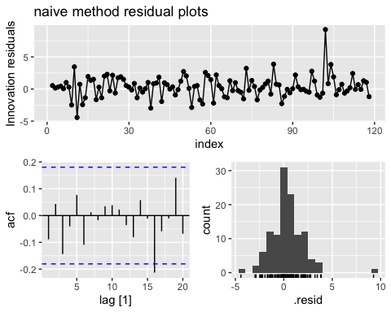

CNA Stock Price Forecast with Basic Methods
================
Teik Keat Tee
2023-12-12

## 1.0 Preliminaries

Prior to the stock price forecasting analysis, some actions needed to be
taken care of. These include data extraction and processing, as well as
importing dependencies.

## 1.1 Import dependencies

``` r
library(fpp3)
library(gridExtra)
library(ggplot2)
library(tidyverse)
```

## 1.2 Data Extraction and Preprocessing

Centrica’s stock is selected as the choice of investment here. Centrica
is a British multinational integrated energy company that mainly focuses
on supplying gas and electricity to British consumers. The stock
(ticker: CNA) was listed on the London Stock Exchange (LSE) and it is a
constituent of the FTSE 100 index. Throughout the global turmoil in
recent years, the stock performed relatively well compared to the
market.

The time series data of interest here is the **daily adjusted close
price of CNA** from the **period 4 January 2010 to 19 October 2023**.
The raw data was downloaded from Yahoo Finance. The data was split into
three ways:

1.  4 January 2010 to 30 September 2023 - for the historical data
    analysis

2.  1 March 2023 to 29 September 2023 - for the main analysis.

3.  2 October 2023 to 19 October 2023 - for the analysis of 14-day
    forecasts..

Note that the adjusted close price was selected for the analysis as it
has already taken account into dividends and splits. It was also
generally perceived as the better indicator to use. Besides, the prices
observed were in Pence Stirlings (GBX).

The R code is as follows:

``` r
# Read csv file which contains raw data from yahoo finance download
cna_df <- data.frame(read_csv("https://raw.githubusercontent.com/teikkeat80/Stock_Price_Forecast_Basic/main/stock_price_data/CNA.csv"))
```

    ## Rows: 3484 Columns: 7
    ## ── Column specification ────────────────────────────────────────────────────────
    ## Delimiter: ","
    ## chr (1): Date
    ## dbl (6): Open, High, Low, Close, Adj Close, Volume
    ## 
    ## ℹ Use `spec()` to retrieve the full column specification for this data.
    ## ℹ Specify the column types or set `show_col_types = FALSE` to quiet this message.

``` r
# Inspect raw data
head(cna_df)
```

    ##         Date  Open  High   Low Close Adj.Close   Volume
    ## 1 04/01/2010 281.0 283.0 279.8 281.3  137.0878 11421692
    ## 2 05/01/2010 281.4 283.3 279.0 281.1  136.9904 11914587
    ## 3 06/01/2010 281.8 282.3 278.3 278.9  135.9182  8098311
    ## 4 07/01/2010 277.8 279.6 272.9 274.8  133.9202 10381002
    ## 5 08/01/2010 280.1 283.2 276.7 279.5  136.2106 16510321
    ## 6 11/01/2010 279.8 281.1 278.5 280.2  136.5517  8519933

``` r
# Convert date from chr to date and sort 
cna_df$Date <- as.Date(cna_df$Date, format = "%d/%m/%Y")
cna_df_sorted <- cna_df %>% 
  arrange(Date)

# Convert the series to a tsibble object, setting regular to FALSE to account 
# for non-trading days
cna_ts <- cna_df_sorted %>% 
  as_tsibble(index = Date,
             regular = FALSE)

# Remove unused columns (Same as extracting only date and adj close column)
cna_adj <- cna_ts %>% 
  select("Date", "Adj.Close")

# Rename columns for better coding practice
colnames(cna_adj) <- c("date", "adj_close")

# Split the data into three sets as mentioned above
cna_hist <- cna_adj %>% 
  filter_index(. ~ "2023-09-29")

# Extract data for main analysis 
# Data from the period of 1 March 2023 to 29 September 2023
cna_dt <- cna_adj %>% 
  filter_index("2023-03-01" ~ "2023-09-29")

# Extract data for forecast analysis 
# 14 days of actual data for comparison purpose
cna_14d_act <- cna_adj %>% 
  filter_index("2023-10-02" ~ .)

# Here, I am only inspecting the main data set.
head(cna_dt)
```

    ## # A tsibble: 6 x 2 [!]
    ##   date       adj_close
    ##   <date>         <dbl>
    ## 1 2023-03-01      101.
    ## 2 2023-03-02      102.
    ## 3 2023-03-03      102.
    ## 4 2023-03-06      102.
    ## 5 2023-03-07      102.
    ## 6 2023-03-08      102.

The dependencies and 3 sets of data is ready now for the analysis.

------------------------------------------------------------------------

## 2.0 Time Series Plots

Several time series plots were generated to illustrate the CNA’s price
movements within the selected time-frame. These include:

- Time plot
- Weekly seasonal plot
- Lag plot
- Autocorrelation plot

The R code is as follows:

``` r
# Plotting the adjusted close time series using autoplot() function
cna_dt %>% 
  autoplot(adj_close) + 
  labs(y = "Adj. close price (GBX)",
       title = "Centrica's (symbol: CNA) Adjusted Close Price",
       subtitle = "1 March 2023 - 29 September 2023")
```

<!-- -->

As shown in the 7-month time plot above, I can generally observe an
upwards movement in CNA’s stock price.

I can also observe a surge in late July/early August’s stock price,
followed by an increase at a higher rate reaching its peak in
mid-September. This is mainly attributed to the company’s strong interim
financials reported on 27 July 2023. The report has announced a ten-fold
profit increase in its British Gas business, alongside a proposal for
enhancements in its dividends policies and buybacks programme. These
were positive news to the investors and therefore the company’s share
prices were driven upwards sharply.

Apart from that, the plot has also demonstrated a steep decline in CNA’s
share price towards the end of September. This was driven fundamentally
by analyst reports, which tend to ‘downgrade’ the stock and encourage
investors to take profits. (e.g. see [ShareCast
news](https://www.sharecast.com/news/broker-recommendations/centrica-shares-approaching-fair-value-says-bofa-ml--14809599.html))

Next, I will be looking at the weekly seasonal plots. This attempt is to
identify seasonal effects such as the ‘Monday effect’ in the 7-month
time series.

R code is as follows:

``` r
# Generate weekly seasonal plot using gg_season
cna_dt %>% 
  gg_season(adj_close, period = "week") + 
  theme(legend.position = "None") + 
  labs(y = "Adj. close price (GBX)",
       title = "Weekly seasonal plot: CNA's Adjusted Close Price",
       subtitle = "1 March 2023 - 29 September 2023")
```

<!-- -->

The illustration above shows no weekly seasonal effect at all. To
identify other stock price-related seasonality effects, such as within
yearly windows, I have to use larger data sets. This will be shown in
the next section.

Furthermore, I will illustrate the data in lag plots and ACF
(autocorrelation function) correlogram. These plots help to identify
trends in stock price data and determine statistical properties of the
series.

R code is as follows:

``` r
# Generate lag plots using gg_lag()
cna_plot_lag <- cna_dt %>% 
  gg_lag(adj_close, geom = "point") + 
  theme(legend.position = "None") + 
  labs(x = "lag(Adj. close price (GBX), k)",
    y = "Adj. close price (GBX)", 
    title = "Lag plot: CNA's price")

# Generate ACF plots using ACF()
cna_plot_acf <- cna_dt %>% 
  ACF(adj_close) %>% 
  autoplot() + 
  labs(title = "ACF plot: CNA's price")

# Illustrating both plots side-by-side
grid.arrange(cna_plot_lag, cna_plot_acf, ncol = 2)
```

<!-- -->

From both the lag and ACF plots, I observe strong temporal patterns in
the stock price. The lag plot shows a positive relationship between
prices and lagged prices. Besides, the ACF plot shows strong
autocorrelation that diminishes linearly as the lags increase. These
characteristics imply a strong upside trend and long memory behaviour.

In short, the 7-month CNA’s adjusted close price demonstrated an upward
trend with a strong temporal pattern. Although there were sharp
inclination and declination in the time plot, however, these phenomena
were mostly event-driven and can be explained through fundamental
analysis. Moreover, the price data shows no seasonal effect.

------------------------------------------------------------------------

## 3.0 Historical Data Analysis

To analyse the historical data, I will be covering CNA’s adjusted stock
prices from 4 January 2010 onwards. This is in light of the time frame
roughly covering an economic cycle, from the end of 08/09’s recession
until recent days.

Apart from that, it would be sensible to compare the historical CNA
prices with the listing stock index. Therefore, here I queried the FTSE
100 market index data to compare with CNA’s price within the same time
frame. The FTSE 100 daily data were obtained from investing.com.

``` r
# Import FTSE 100 data
# PLEASE CHANGE FILE PATH TO REPRODUCE
ftse_raw <- data.frame(read_csv("https://raw.githubusercontent.com/teikkeat80/Stock_Price_Forecast_Basic/main/stock_price_data/FTSE100.csv"))
```

    ## Rows: 3470 Columns: 7
    ## ── Column specification ────────────────────────────────────────────────────────
    ## Delimiter: ","
    ## chr (3): Date, Vol., Change %
    ## num (4): Price, Open, High, Low
    ## 
    ## ℹ Use `spec()` to retrieve the full column specification for this data.
    ## ℹ Specify the column types or set `show_col_types = FALSE` to quiet this message.

``` r
# Clean up data and convert to tsibble
ftse_raw$Date <- as.Date(ftse_raw$Date, format = "%m/%d/%Y")
ftse_raw$Price <- as.numeric(gsub(",", "", ftse_raw$Price))

ftse_dt <- ftse_raw %>% 
  arrange(Date) %>% 
  as_tsibble(index = Date, regular = FALSE) %>% 
  select(Date, Price)

colnames(ftse_dt) <- c("date", "close")
```

Then, I first visualise the historical CNA’s data:

``` r
# Generate time plot
cna_hist %>%
  autoplot(adj_close) +
  labs(y = "Adj. close price (GBX)",
       title = "Centrica's (symbol: CNA) Adjusted Close Price",
       subtitle = "4 January 2010 - 29 September 2023")
```

<!-- -->

The time plot for historical prices demonstrated a cyclic behaviour that
is similar to what economic cycles suggest. This can be explained by the
nature of Centrica’s business, which serves as a foundation for economic
activities.

To identify yearly seasonal effect in the historical dataset, I consider
the seasonal plot as below:

``` r
# Generate yearly seasonal plot
cna_hist %>%
  gg_season(adj_close, period = "year") +
  theme(legend.position = "None") +
  labs(y = "Adj. close price (GBX)",
       title = "Yearly seasonal plot: CNA's Adjusted Close Price",
       subtitle = "4 January 2010 - 29 September 2023")
```

<!-- -->

By visualising the seasonal plot above, I found no seasonality. The
result is reasonable as it would be difficult to detect seasonality in
stock prices, due to their randomness.

Next, I compare CNA’s price movement alongside the dynamics of the
market index. Note that I would be using their log prices for comparison
as both series have different units and scales.

``` r
# Generate seasonal plot for the market index
ftse_dt %>% 
  gg_season(close, period = "year")  + 
  theme(legend.position = "None") + 
  labs(y = "Close price (GBP)",
       title = "Yearly seasonal plot: FTSE 100 Close Price",
       subtitle = "4 January 2010 - 29 September 2023")
```

<!-- -->

``` r
# Generate plots for CNA and FTSE 100 log price for comparability
# Generate time plot for the FTSE 100 index
ftse_plot <- ftse_dt %>% 
  autoplot(log(close)) + 
  labs(y = "log price (GBP)",
       title = "FTSE 100 log price",
       subtitle = "4 January 2010 - 29 September 2023")

# Generate time plot for CNA's price
cna_plot_hist <- cna_hist %>% 
  autoplot(log(adj_close)) + 
  labs(y = "log price (GBX)",
       title = "Centrica's (symbol: CNA) log price",
       subtitle = "4 January 2010 - 29 September 2023")

# Comparing both plots side by side
grid.arrange(ftse_plot, cna_plot_hist, nrow = 2)
```

<!-- -->

Firstly, I failed to detect any seasonal effect from the seasonal plot
for the market index. This strengthens the argument above that stock
prices contain randomness and it would be difficult to identify any
seasonality from its price dynamics. This analysis suggested that
investors should not take account of seasonality when making investment
decisions, however, it might also be subject to the selection of stocks.

Moreover, from the side-by-side comparison of the time plots, I observed
that CNA’s log prices tend to move in a similar direction alongside FTSE
100 index’s log prices, from 2010 to 2016, and late 2019 to 2023.
However, it seems difficult to observe any correlational patterns for
both prices from 2017 to 2019. To better visualise this effect, I break
the series into three different time frames and visualise their scatter
plots individually.

``` r
# Generate scatter plots to visualise the correlation between both prices
# First plot - 2010 to 2016
cna_ftse_plot_1016 <- inner_join(cna_hist, ftse_dt, by = "date") %>% 
  filter_index(. ~ "2016") %>% 
  ggplot(aes(x = log(close), y = log(adj_close))) + 
  geom_point() + 
  labs(x = "FTSE 100 log price",
       y = "CNA log price",
       title = "2010 - 2016")

# Second plot - 2017 to 2019
cna_ftse_plot_1620 <- inner_join(cna_hist, ftse_dt, by = "date") %>% 
  filter_index("2017" ~ "2019") %>% 
  ggplot(aes(x = log(close), y = log(adj_close))) + 
  geom_point() + 
  labs(x = "FTSE 100 log price",
       y = "CNA log price",
       title = "2017 - 2019")

# Third plot - 2020 to 2023
cna_ftse_plot_2023 <- inner_join(cna_hist, ftse_dt, by = "date") %>% 
  filter_index("2020" ~ .) %>% 
  ggplot(aes(x = log(close), y = log(adj_close))) + 
  geom_point() + 
  labs(x = "FTSE 100 log price",
       y = "CNA log price",
       title = "2020 - 2023")

# Show plots
grid.arrange(cna_ftse_plot_1016, 
             cna_ftse_plot_1620, 
             cna_ftse_plot_2023, 
             ncol = 2, nrow = 2)
```

<!-- -->

According to the scatter plots above, I found positive correlation
patterns in the time frames 2010 - 2016 and 2020 - 2023, while failed to
observe any obvious patterns in 2017 - 2019. This can be explained by
the UK government’s policy of opening up the market in 2014, which
introduced competition that diluted the market share of original energy
giants. This impact has lasted until the next economic shock. Apart from
this behaviour, Centrica’s stock price movement seems to be in
accordance with what the market suggested, especially during the COVID
pandemic recovery period. Therefore, investors should be able to infer
the long-term dynamics of CNA’s stock prices from observing the FTSE
100’s index, or vice versa.

------------------------------------------------------------------------

## 4.0 Modelling

By focusing only on the 7-month time frame, I aim to model and produce
forecasts for CNA’s stock price, through employing simple forecasting
methods. As there were no suitable transformations identified (within
the scope of this assignment) and no seasonality detected, I will just
be simply modelling the adjusted stock price.

Firstly, the data will be split into training and testing data sets.
This process is to ensure that we can evaluate the fitted model on a
different set of data, thus ensuring a reliable indication of the
accuracy of the fitted model. The common 80/20 ratio will be employed
here.

``` r
# For modelling and forecasting, the tsibble has to be regularised and 
# re-indexed based on trading days
cna_dt_reg <- cna_dt %>% 
  mutate(index = row_number()) %>% 
  update_tsibble(index = index, regular = TRUE)

# Compute the train and test set using slice()
cna_dt_train <- cna_dt_reg %>% 
  slice(1 : round(nrow(cna_dt) * 0.8))

cna_dt_test <- cna_dt_reg %>% 
  slice((nrow(cna_dt_train) + 1) : nrow(cna_dt))
```

Next, I will fit the non-seasonal simple forecasting models (mean,
naïve, and random walk with drift methods) to the training data. This is
to determine which method would be the best in forecasting CNA’s stock
price.

``` r
# Fitting the model with mean, naive and drift methods
cna_fit <- cna_dt_train %>% 
  model(mean = MEAN(adj_close), 
        naive = NAIVE(adj_close), 
        drift = RW(adj_close ~ drift())
        )
```

To understand holistically how well the models fit, it would be
necessary to evaluate the fitted values and innovation residuals. For
residual diagnostics, the time and ACF plot as well as the histogram for
residuals can be helpful to identify its properties.

Therefore, the R code is as follows:

``` r
# To generate the residual plots for each model, I have to split the models to 
# generate their own residual plots.
cna_fit_mean <- cna_fit %>% 
  select(mean)

cna_fit_naive <- cna_fit %>% 
  select(naive)

cna_fit_drift <- cna_fit %>% 
  select(drift)
```

``` r
# Generating the plots using the shortcut gg_tsresiduals()

# Plot residuals for mean method
cna_fit_mean %>% 
  gg_tsresiduals() + 
  labs(title = "mean method residual plots")
```

<!-- -->

``` r
# Plot residuals for naive method
cna_fit_naive %>% 
  gg_tsresiduals() + 
  labs(title = "naive method residual plots")
```

<!-- -->

``` r
# Plot residuals for drift method
cna_fit_drift %>% 
  gg_tsresiduals() + 
  labs(title = "drift method residual plots")
```

<!-- -->

By only inspecting the residual plots, I found that the mean method is
the worst-fitted model, as its residuals time plot and ACF plot
demonstrated a strong upward trend, which violated the white noise
residuals assumption. Both naive and drift methods exhibited similar
residual behaviour. These 2 models seem to have residuals with
close-to-zero mean and tend to follow a white noise process, apart from
one outlier. However, the drift method’s residual histogram shows a
better approximation to a bell-curve shape in comparison to the naive
method’s histogram, when the outliers were ignored.

To obtain a stronger conclusion, I consider the Ljung-Box test for
autocorrelation and the Shapiro-Wilk test for normality.

``` r
# Testing autocorrelation using the Ljung-Box statistics, 
# and normality using the Shapiro test
cna_fit_aug <- cna_fit %>% 
  augment()

# For Ljung-Box test, I am using lag = 10 as I detect no seasonality in the data
cna_fit_aug %>% 
  features(.innov, ljung_box, lag = 10)
```

    ## # A tibble: 3 × 3
    ##   .model lb_stat lb_pvalue
    ##   <chr>    <dbl>     <dbl>
    ## 1 drift     6.52     0.770
    ## 2 mean    811.       0    
    ## 3 naive     6.52     0.770

``` r
# Shapiro-Wilk test for normality
st_result <- cna_fit_aug %>% 
  as_tibble() %>% 
  group_by(.model) %>% 
  summarise(st_stat = shapiro.test(.innov)$statistic,
            st_pvalue = shapiro.test(.innov)$p.value)

# Shapiro-Wilk test for normality (after removing outliers of residuals using IQR)
st_result_wo_out <- cna_fit_aug %>% 
  as_tibble() %>% 
  group_by(.model) %>% 
  mutate(
    Q1 = quantile(.innov, 0.25, na.rm = TRUE),
    Q3 = quantile(.innov, 0.75, na.rm = TRUE),
    IQR_value = IQR(.innov, na.rm = TRUE),
    lower_bound = Q1 - 1.5 * IQR_value,
    upper_bound = Q3 + 1.5 * IQR_value
  ) %>%
  filter(.innov >= lower_bound & .innov <= upper_bound) %>% 
  summarise(st_stat_wo_out = shapiro.test(.innov)$statistic,
            st_pvalue_wo_out = shapiro.test(.innov)$p.value)
```

``` r
# Show Shapiro-Wilk test result table
inner_join(st_result, st_result_wo_out, by = ".model")
```

    ## # A tibble: 3 × 5
    ##   .model st_stat st_pvalue st_stat_wo_out st_pvalue_wo_out
    ##   <chr>    <dbl>     <dbl>          <dbl>            <dbl>
    ## 1 drift    0.930 0.0000126          0.993        0.833    
    ## 2 mean     0.934 0.0000193          0.939        0.0000530
    ## 3 naive    0.930 0.0000126          0.993        0.833

The Ljung-Box test result demonstrated large p-values for the naive and
drift methods, this suggested no autocorrelation for the residual
series. However, the mean method shows autocorrelated residual series,
which implies the mean model’s residuals do not follow a white noise
process.

Furthermore, by employing the Shapiro-Wilk test for normality and
considering the whole set of innovation residuals, I found the residuals
departed from normality for all 3 models (small p-values, see column
‘st_pvalue’). This result seems in accordance with what the mean model’s
residual histogram plot suggests.

However, regarding naive and drift models, the non-normal residuals are
caused by outliers. Therefore, I employed the Interquartile Range (IQR)
method to exclude outlying residuals and ran the test again. Larger
p-values (see column ‘st_pvalue_wo_out’) for drift and naive methods
were obtained when outliers were removed. Consequently, the residuals
from both of these models should follow the normality assumption.

Given the above results, I excluded the mean method and evaluated the
forecast performance of both naive and drift methods by comparing them
against the testing data.

``` r
# Exclude the mean method from the original model
cna_fit <- cna_fit %>% 
  select(-mean)

# Produce forecast with time horizon covering the testing data
cna_fc <- cna_fit %>% 
  forecast(h = nrow(cna_dt_test))

# Generating plots and compare forecasts with testing data
cna_fc_plot_pt <- cna_fc %>% 
  autoplot(cna_dt_train, level = NULL) + 
  autolayer(cna_dt_test, adj_close, colour = "gray") + 
  labs(y = "Adj. close price (GBX)", 
       title = "CNA's Adjusted Close Price Point Forecast", 
       subtitle = "1 March 2023 - 29 September 2023") + 
  guides(colour = guide_legend(title = "Methods"))

cna_fc_plot_drift <- cna_fit_drift %>% 
  forecast(h = nrow(cna_dt_test)) %>% 
  autoplot(cna_dt_train) + 
  autolayer(cna_dt_test, adj_close, colour = "red") + 
  labs(y = "Adj. close price (GBX)", 
       title = "CNA's Forecast (Drift)"
       )

cna_fc_plot_naive <- cna_fit_naive %>% 
  forecast(h = nrow(cna_dt_test)) %>% 
  autoplot(cna_dt_train) + 
  autolayer(cna_dt_test, adj_close, colour = "red") + 
  labs(y = "Adj. close price (GBX)", 
       title = "CNA's Forecast (Naive)"
       )

# Arrange and show plots
cna_fc_plot_pt
```

<!-- -->

``` r
grid.arrange(cna_fc_plot_drift, cna_fc_plot_naive, nrow = 2)
```

<!-- -->

By looking at the above plots, I found the drift method provides a
better performance, as it captures the upward trend and trend reversion
in the testing data, with only a small portion of data points falling
outside its 95% confidence interval. Nevertheless, it would be sensible
to compute their forecasting errors and evaluate the models’ accuracy.

``` r
# Generating the accuracy table for both naive and drift models
accuracy(cna_fc, cna_dt_test)
```

    ## # A tibble: 2 × 10
    ##   .model .type    ME  RMSE   MAE   MPE  MAPE  MASE RMSSE  ACF1
    ##   <chr>  <chr> <dbl> <dbl> <dbl> <dbl> <dbl> <dbl> <dbl> <dbl>
    ## 1 drift  Test   10.1  12.4  10.1  6.21  6.21   NaN   NaN 0.877
    ## 2 naive  Test   15.4  17.8  15.4  9.47  9.47   NaN   NaN 0.911

The above table shows that the drift method produces smaller error
values across all error metrics in comparison to the naive method.
Hence, I conclude that the **random walk with drift method** would be
the best model, out of all three simple forecasting methods, for
forecasting CNA’s daily adjusted stock price.

## 4.1 Forecasting

According to the analysis above, the random walk with drift method seems
to be an accurate forecasting model for CNA’s daily stock prices. Hence,
here I would attempt to employ the drift method to forecast the stock
price for the next 14 consecutive trading days starting from 2 October
2023.

The R code is as follows:

``` r
# Re-model and generate forecasts for the next 14 trading days
cna_14d_fc <- cna_dt_reg %>% 
  model(RW(adj_close ~ drift())) %>%
  forecast(h = 14)

# Re-index the 14 days actual data for plotting
cna_14d_act_reg <- cna_14d_act %>% 
  mutate(index = (row_number() + nrow(cna_dt_reg))) %>% 
  update_tsibble(index = index, regular = TRUE)

# Plot against the actual values
cna_14d_fc %>% 
  autoplot(cna_dt_reg) + 
  autolayer(cna_14d_act_reg, 
            adj_close, 
            colour = "red"
            ) + 
  labs(y = "Adj. close price (GBX)", 
       title = "CNA's Adjusted Close Price Forecast using Drift Method", 
       subtitle = "Forecast period: 2 October 2023 - 19 October 2023")
```

<!-- -->

Moreover, the accuracy table shows:

``` r
accuracy(cna_14d_fc, cna_14d_act_reg)
```

    ## # A tibble: 1 × 10
    ##   .model                  .type    ME  RMSE   MAE   MPE  MAPE  MASE RMSSE  ACF1
    ##   <chr>                   <chr> <dbl> <dbl> <dbl> <dbl> <dbl> <dbl> <dbl> <dbl>
    ## 1 RW(adj_close ~ drift()) Test  -1.85  3.56  2.69 -1.26  1.79   NaN   NaN 0.692

From the plot above, I can observe that the drift method’s forecast
tends to be quite accurate in the 14 trading days horizon. In fact, the
accuracy table shows much lower forecast errors in magnitude, when
compared to the error evaluation during the testing phase. However, the
negative direction from the mean error (ME) can be concerning. The
forecast method might indicate a buy signal, but the negative error is
showing an adverse effect on the strategy (a drop in the share price).
Nevertheless, the drift method performed relatively well in this case.

------------------------------------------------------------------------

## 5.0 Analysis

The Drift method is a method that allows forecasts to increase or
decrease over time, thus it tends to perform relatively well in trending
time series such as the price data above. The uptrend reflected in
Centrica’s stock prices within this 7-month time frame was mainly backed
by fundamental reasons such as company performance and share buyback
policies. These factors contributed as a support to continuously push
the price upwards throughout this period. Consequently, the trend
extrapolation by drift models works well in this case.

Nevertheless, stock prices were very sensitive to shocks and could be
volatile when new information arrived. We can observe this behaviour
from the first half of the forecast horizon, where the price drop
resulting from adverse analyst reports cannot be captured by the simple
drift method. If one only considers forecasts with shorter horizons,
he/she might receive different information from the model. Furthermore,
although the analysis above shows that stock prices tend to revert back
to their trend, investors can still be out of money before the reversion
happens. As a result, simple forecasting methods should not be employed
solely for predicting stock price movement.

------------------------------------------------------------------------

## 6.0 Conclusion and Recommendation

Stock price level generally serves as an indicator of the company’s
current value and its expectations. The analysis above has helped us to
identify a strong uptrend in CNA’s price series, thus providing a
positive outlook for the company’s future performance. As discussed in
previous section, fundamental analyses also suggested that this trending
behaviour should be sustainable, as it was supported by the business’s
strong profitability and visionary investment plans. As a result, I
would expect the stock price will continue to drive upward, at least
within its current financial year. However, event analysis and the
overall market’s behaviour were also important factors for monitoring
CNA’s stock price, as they could have a substantial impact on the price
movement, which might eventually change the price dynamics. Ultimately,
stock price forecasting is a complicated process that cannot be
addressed by a single model, while the process should also be constantly
revisited to ensure all factors are considered.

------------------------------------------------------------------------

## Session Info

``` r
sessionInfo()
```

    ## R version 4.3.2 (2023-10-31)
    ## Platform: x86_64-apple-darwin20 (64-bit)
    ## Running under: macOS Ventura 13.2.1
    ## 
    ## Matrix products: default
    ## BLAS:   /Library/Frameworks/R.framework/Versions/4.3-x86_64/Resources/lib/libRblas.0.dylib 
    ## LAPACK: /Library/Frameworks/R.framework/Versions/4.3-x86_64/Resources/lib/libRlapack.dylib;  LAPACK version 3.11.0
    ## 
    ## locale:
    ## [1] en_US.UTF-8/en_US.UTF-8/en_US.UTF-8/C/en_US.UTF-8/en_US.UTF-8
    ## 
    ## time zone: Asia/Kuala_Lumpur
    ## tzcode source: internal
    ## 
    ## attached base packages:
    ## [1] stats     graphics  grDevices datasets  utils     methods   base     
    ## 
    ## other attached packages:
    ##  [1] forcats_1.0.0     stringr_1.5.1     purrr_1.0.2       readr_2.1.5      
    ##  [5] tidyverse_2.0.0   gridExtra_2.3     fable_0.3.3       feasts_0.3.2.9000
    ##  [9] fabletools_0.4.1  tsibbledata_0.4.1 tsibble_1.1.4     ggplot2_3.5.0    
    ## [13] lubridate_1.9.3   tidyr_1.3.1       dplyr_1.1.4       tibble_3.2.1     
    ## [17] fpp3_0.5         
    ## 
    ## loaded via a namespace (and not attached):
    ##  [1] ggdist_3.3.2         rappdirs_0.3.3       utf8_1.2.4          
    ##  [4] generics_0.1.3       anytime_0.3.9        renv_1.0.3          
    ##  [7] stringi_1.8.3        hms_1.1.3            digest_0.6.35       
    ## [10] magrittr_2.0.3       evaluate_0.23        grid_4.3.2          
    ## [13] timechange_0.3.0     fastmap_1.1.1        fansi_1.0.6         
    ## [16] viridisLite_0.4.2    scales_1.3.0         cli_3.6.2           
    ## [19] rlang_1.1.3          crayon_1.5.2         bit64_4.0.5         
    ## [22] ellipsis_0.3.2       munsell_0.5.1        withr_3.0.0         
    ## [25] yaml_2.3.8           parallel_4.3.2       tools_4.3.2         
    ## [28] tzdb_0.4.0           colorspace_2.1-0     curl_5.2.0          
    ## [31] vctrs_0.6.5          R6_2.5.1             lifecycle_1.0.4     
    ## [34] bit_4.0.5            vroom_1.6.5          pkgconfig_2.0.3     
    ## [37] progressr_0.14.0     pillar_1.9.0         gtable_0.3.4        
    ## [40] glue_1.7.0           Rcpp_1.0.12          highr_0.10          
    ## [43] xfun_0.42            tidyselect_1.2.1     rstudioapi_0.15.0   
    ## [46] knitr_1.45           farver_2.1.1         htmltools_0.5.7     
    ## [49] labeling_0.4.3       rmarkdown_2.25       compiler_4.3.2      
    ## [52] distributional_0.4.0
